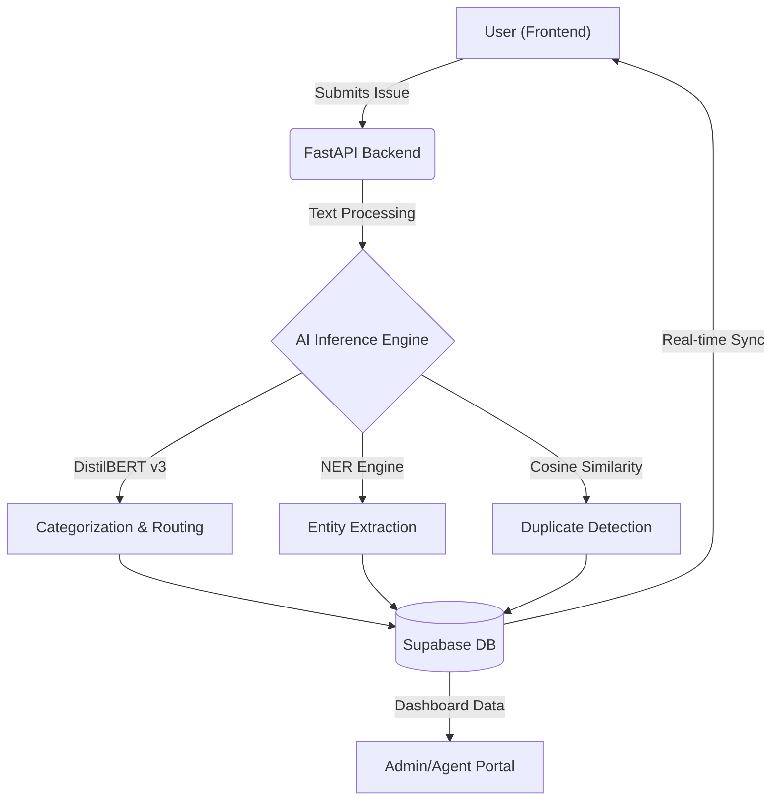

<div align="center">

# `H E L P D E S K . A I`
**The Intelligent Standard for Enterprise IT Service Management**

[](https://opensource.org/licenses/MIT)
[](https://helpdeskaiv1.vercel.app/)
[](https://huggingface.co/spaces/ritesh19180/ai-helpdesk-api)

--

### ⚡ Eliminating the Manual Triage Bottleneck.
*Helpdesk.ai uses deep-learning neural networks and 4-layer enterprise architecture to categorize, prioritize, and resolve IT issues in milliseconds.*

[Launch Application](https://helpdeskaiv1.vercel.app/) • [Contact Enterprise](https://helpdeskaiv1.vercel.app/contact-sales) • [API Documentation](https://ritesh19180-ai-helpdesk-api.hf.space/docs)

</div>

<br/>

## 💎 The Enterprise Evolution

Helpdesk.ai isn't just a ticketing tool; it's a **Neural IT Orchestrator**. Built to handle the complex requirements of modern organizations, it scales support without scaling headcount.

### 🏛️ 4-Layer Permission Matrix
Our architecture is meticulously designed for multi-tenant, zero-trust security. 
> [Explore the full 30+ Page Map in [PLATFORM_MAP.md](./PLATFORM_MAP.md)]

| Layer | Audience | Primary Capabilities |
| :--- | :--- | :--- |
| **👑 Master Admin** | Global Overseers | Tenant Registration, Company Onboarding, Global Health Monitoring, Bug Oversight. |
| **🏢 Company Admin** | IT Management | Org-specific Dashboard, User Auditing, Sentiment Analytics, SLA Performance Tracking. |
| **👤 Standard User** | Employees | AI-Powered Ticket Creation, Semantic Search, Real-time Status tracking, Auto-Resolution. |
| **🌐 Public Layer** | Prospects | Premium "Chaos to Clarity" journey, Sales Engineering contact, Live Pricing tiers. |

---

## 🏗️ System Architecture

Helpdesk.ai utilizes a clean, decoupled architecture built for production SaaS environments. 



---

## 🧠 The AI Neural Pipeline

Under the hood, Helpdesk.ai leverages a custom-orchestrated suite of transformer models and heuristics.

### 1. High-Precision Classification
Driven by **DistilBERT v3**, our classifier doesn't just predict categories—it understands technical context and user sentiment to assign accurate **Impact Scores** and **Priority Levels** (`Low`, `Medium`, `High`, `Critical`).

### 2. NER Metadata Harvesting
Our **Named Entity Recognition (NER)** engine automatically extracts vital technical identifiers:
- **Assets**: Hostnames, Serial Numbers, IP Addresses.
- **Environment**: Software versions, Browser types, OS identifiers.
- **Physicality**: Office locations, Lab IDs, Workstations.

### 3. Proactive Duplicate Prevention
Using `sentence-transformers` and **Cosine Similarity**, the system prevents "Ticket Floods" during incidents. If two users report the same outage, the AI semantically links them in real-world time.

### 4. Visionary OCR & Reasoning
- **Intelligent OCR**: Built-in screenshot analysis to pull error codes from user-uploaded images via Tesseract.
- **Gemini Reasoning**: Advanced LLM integration for generating human-like auto-resolutions and knowledge base summaries.

---

## ✨ Feature Ecosystem

The Helpdesk.ai platform is composed of 30+ specialized page-modules for a complete enterprise experience.
> [Read the full Feature Deep-Dive Document here](./PLATFORM_MAP.md)

### 🌓 User Experience
- **Chaos-to-Clarity UI**: A premium, responsive interface that guides users through ticket creation.
- **AI Processing Simulator**: Visual feedback showcasing the neural network's analysis in real-time.
- **Auto-Resolve Chat**: An interactive interface where the AI attempts to fix issues before they reach a human.
- **Smart Knowledge Check**: Proactive suggestion of relevant documentation during the "Help" journey.

### 📊 Administrative Suite
- **Insight Analytics**: Real-time ticket trends, team performance metrics, and sentiment heatmaps.
- **Identity Orchestration**: Role-based access control (RBAC) with secure invite-only onboarding for whole companies.
- **Audit Logging**: Full traceability for security compliance.
- **Shadow IT Monitoring**: Analytics to identify recurring non-standard software issues.

### ⚡ Technical Infrastructure
- **Stripe Subscriptions**: Seamless transition between `Starter` and `Growth` tiers with custom loading redirections.
- **Enterprise Leads Hub**: Dedicated B2B capture system for custom infra and SLA configurations.
- **Supabase Integrity**: Row-Level Security (RLS) ensures data isolation across hundreds of companies.

---

## 🛠️ Technology Ecosystem

| Category | Premium Stack |
| :--- | :--- |
| **Core** |    |
| **Intelligence** |    |
| **Logic** |   |
| **Security** |   |
| **Ops** |    |

---

## 🚀 Deployment & Local Orchestration

### 1. Environment Configuration
Create a `.env` file in the `/Frontend` directory:
```bash
VITE_SUPABASE_URL=your_project_url
VITE_SUPABASE_ANON_KEY=your_key
VITE_STRIPE_GROWTH_LINK=your_stripe_link
VITE_BACKEND_URL=http://localhost:8000
```

### 2. Local Installation
```bash
# Clone the repository
git clone https://github.com/ritesh-1918/HELPDESK.AI.git

# Initialize Frontend
cd HELPDESK.AI/Frontend
npm install
npm run dev
```

### 3. Backend Setup
Navigate to `/backend` and refer to internal documentation for Python environment (`venv`) activation and `uvicorn` startup.

---

<div align="center">

Built with ❤️ by the **HELPDESK.AI Professional** Team  
*Driving the future of Intelligent Enterprise Support.*

</div>
