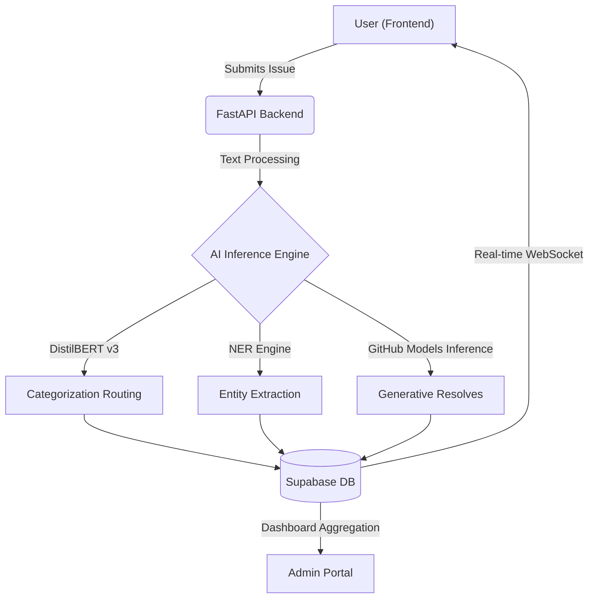

<div align="center">


<h1> Neural System Orchestrator </h1>


<br/>


&nbsp;&nbsp;
<a href="https://github.com/ritesh-1918/HELPDESK.AI/issues?q=is%3Aissue+is%3Aopen+label%3A%22good+first+issue%22">

</a>

<br/><br/>

[](https://opensource.org/licenses/MIT)
[](https://helpdeskaiv1.vercel.app/)

[](https://github.com/Lin081984/fugui-fix-env/actions/workflows/ci.yml)
[](https://github.com/Lin081984/fugui-fix-env/actions/workflows/ci.yml)
[](https://github.com/Lin081984/fugui-fix-env/actions/workflows/ci.yml)
[](https://github.com/Lin081984/fugui-fix-env/actions/workflows/ci.yml)
[](https://github.com/Lin081984/fugui-fix-env/actions/workflows/ci.yml)

<br/>

  <a href="https://helpdeskaiv1.vercel.app/">
    
  </a>
  &nbsp;&nbsp;
  <a href="./MobileApp/application-2d277b36-4dbd-41c8-806d-cb2f19acf38a.apk">
    
  </a>
  &nbsp;&nbsp;
  <a href="https://helpdeskaiv1.vercel.app/contact-sales">
    
  </a>
  &nbsp;&nbsp;
  <a href="https://ritesh-1918.github.io/HELPDESK.AI/">
    
  </a>
  &nbsp;&nbsp;
  <a href="https://ritesh19180-ai-helpdesk-api.hf.space/docs">
    
  </a>

<br/><br/>
</div>

---

## 🌟 GSSoC '26 Contributor & Community Campaign

We are extremely proud to be part of the **GirlScript Summer of Code (GSSoC) 2026**! To ensure high-quality contributions and maximum rewards for both developers and mentors, please review our official [GSSoC Mentorship Guide & Review Standard](MENTORSHIP.md).

To support the project and get real-time open-source project updates, please make sure you participate in our community campaign:

<div align="center">

<h3> 🚀 Support the Orchestrator in 3 Seconds! </h3>

<a href="https://github.com/ritesh-1918/HELPDESK.AI">
  
</a>
&nbsp;&nbsp;
<a href="https://github.com/ritesh-1918/HELPDESK.AI/fork">
  
</a>
&nbsp;&nbsp;
<a href="https://github.com/ritesh-1918">
  
</a>

<br/><br/>

<h3> 💼 Let's Connect and Collaborate! </h3>

<a href="https://www.linkedin.com/in/ritesh1908/">
  
</a>
&nbsp;&nbsp;
<a href="mailto:support@helpdesk.ai">
  
</a>

</div>

---

> [!NOTE]
>
> ### Eliminating the Manual Triage Bottleneck
>
> Helpdesk.ai uses deep-learning neural networks and 4-layer enterprise architecture to categorize, prioritize, and resolve IT issues in milliseconds.

<br/>

## Table of Contents

- [Neural System Orchestrator](#-neural-system-orchestrator-)
- [🎯 Why Helpdesk.AI?](#-why-helpdeskai)
- [💎 The Enterprise Evolution](#-the-enterprise-evolution)
- [🏗️ System Architecture](#%EF%B8%8F-system-architecture)
- [🧠 The AI Neural Pipeline](#-the-ai-neural-pipeline)
- [🚀 Deployment & Operations](#-deployment--operations)
- [🗺️ Roadmap](#%EF%B8%8F-roadmap)
- [📱 Mobile Ecosystem (V1)](#-mobile-ecosystem-v1)
- [👥 Contributors](#-contributors)

---


---

## 🛠️ Tech Stack

HelpDesk.AI is built with a modern, multi-layer technology stack:

| Layer | Technology | Version |
|-------|-----------|---------|
| **Frontend** | React | 19.2 |
| **Frontend** | Vite | 7.x |
| **Frontend** | TailwindCSS | 3.4 |
| **Frontend** | React Router | 7.x |
| **Frontend** | Zustand | 5.x |
| **Frontend** | Ant Design (antd) | 6.x |
| **Frontend** | Recharts | 3.x |
| **Frontend** | Framer Motion | 12.x |
| **Frontend** | Tesseract.js (OCR) | 7.x |
| **Mobile** | React Native + Expo | SDK 54 |
| **Mobile** | Expo Router / Navigation | 7.x |
| **Backend** | FastAPI | 0.104+ |
| **Backend** | Python | 3.10 |
| **Backend** | Uvicorn | 0.24+ |
| **Backend** | PyTorch | 2.0+ |
| **Backend** | HuggingFace Transformers | 4.35+ |
| **Backend** | Sentence-Transformers | 2.2+ |
| **Backend** | EasyOCR | latest |
| **AI/ML** | Google Gemini (google-genai) | latest |
| **AI/ML** | DistilBERT Classifier | custom |
| **AI/ML** | NER Model | custom |
| **Database** | Supabase (PostgreSQL) | 2.22 |
| **Deployment** | Docker | python:3.10-slim |
| **Deployment** | Vercel | production |
| **Deployment** | HuggingFace Spaces | docker |

<br/>

> [!IMPORTANT]
> <h2 id="why-helpdeskai">🎯 Why Helpdesk.AI?</h2>
>
> Helpdesk.AI is more than just a ticketing tool; it is a **Neural Service Orchestrator** designed for modern enterprises. It provides massive ROI by:
>
> 1. **Eliminating the Triage Bottleneck**: By using context-aware AI (DistilBERT), it categorizes 100% of tickets in milliseconds, bypassing the L1 support line entirely.
> 2. **Proactive Resolution**: Integrated LLMs (GitHub Models/Gemini) analyze issues during creation to suggest "Instant Fixes," severely reducing actual ticket volume.
> 3. **Tiered Multi-Tenancy**: Built for true SaaS isolation, it securely isolates completely separate companies within a single Supabase database.

---

<h2 id="the-enterprise-evolution">💎 The Enterprise Evolution</h2>

Helpdesk.ai isn't just a ticketing tool; it's heavily engineered. Built to handle the complex requirements of modern organizations, it scales support without scaling headcount.

### 🏛️ 4-Layer Permission Matrix

| Layer | Audience | Primary Capabilities |
| :--- | :--- | :--- |
| **👑 Master Admin** | Global Overseers | Tenant Registration, Company Onboarding, Global Health Monitoring. |
| **🏢 Company Admin** | IT Management | Org-specific Dashboard, User Auditing, Sentiment Analytics. |
| **👤 Standard User** | Employees | AI-Powered Ticket Creation, Semantic Search, Real-time Status. |
| **🌐 Public Layer** | Prospects | Premium journey, Sales Engineering contact, Live Pricing tiers. |

---

<h2 id="system-architecture">🏗️ System Architecture</h2>

Helpdesk.ai utilizes a clean, decoupled architecture built for production operations.


```mermaid
graph TD
    A["User (Frontend)"] -->|"Submits Issue"| B("FastAPI Backend")
    B -->|"Text Processing"| C{"AI Inference Engine"}
    C -->|"DistilBERT v3"| D["Categorization Routing"]
    C -->|"NER Engine"| E["Entity Extraction"]
    C -->|"GitHub Models Inference"| F["Generative Resolves"]
    D --> G[("Supabase DB")]
    E --> G
    F --> G
    G -->|"Real-time WebSocket"| A
    G -->|"Dashboard Aggregation"| H["Admin Portal"]
```

---

<h2 id="project-structure">📁 Project Structure</h2>

This document outlines the key directories in the HELPDESK.AI repository to help contributors navigate the codebase efficiently.

```
HELPDESK.AI/
├── Frontend/          # React frontend application (Vite-based)
├── backend/           # Backend API services
├── MobileApp/         # Mobile application (Android)
├── Model/             # ML models and AI inference code
├── supabase/          # Supabase database configuration and migrations
├── scripts/           # Utility and automation scripts
├── docs/              # Documentation files
├── app/               # Main application entry point
├── src/               # Source code modules
├── tests/             # Test suites and fixtures
├── k8s/               # Kubernetes deployment manifests
├── deploy/            # Deployment configurations and scripts
├── middleware/        # Express/FastAPI middleware components
├── utils/             # Helper functions and utilities
├── static/            # Static assets (CSS, images)
├── templates/         # HTML templates
└── ...
```

| Directory | Purpose |
| :--- | :--- |
| **Frontend/** | React-based web UI built with Vite |
| **backend/** | FastAPI/Node.js backend API services |
| **MobileApp/** | React Native mobile application |
| **Model/** | Machine learning models (DistilBERT, NER, OCR) |
| **supabase/** | Database schema, migrations, and edge functions |
| **scripts/** | Build, deployment, and utility scripts |
| **docs/** | Project documentation and guides |
| **app/** | Core application logic |
| **src/** | Shared source modules and libraries |
| **tests/** | Unit, integration, and E2E tests |
| **k8s/** | Kubernetes manifests for production deployment |
| **deploy/** | CI/CD pipelines and deployment configs |
| **middleware/** | Authentication, logging, and request middleware |
| **utils/** | Common utilities and helper functions |
| **static/** | Static assets served by the application |
| **templates/** | HTML/email templates |

---

<h2 id="the-ai-neural-pipeline">🧠 The AI Neural Pipeline</h2>

Under the hood, Helpdesk.ai leverages a custom suite of high speed models.

<table width="100%">
  <tr>
    <td width="50%" valign="top">
      <h3>1. High-Precision Classification</h3>
      <p>Driven by <b>DistilBERT v3</b>, our classifier understands technical context and user sentiment to assign accurate Impact Scores.</p>
      <h3>2. NER Metadata Harvesting</h3>
      <p>Automatically extracts vital technical identifiers without making the user fill out long dropdown forms:</p>
      <ul><li>Hostnames, Serial Numbers, IP Addresses.</li></ul>
    </td>
    <td width="50%" valign="top">
      <h3>3. Duplicate Prevention</h3>
      <p>If two users report the same outage, our <code>sentence-transformers</code> semantically link them to prevent "Ticket Flooding".</p>
      <h3>4. Generative OCR</h3>
      <p>Built-in screenshot analysis pulls error codes directly out of images. We process the images securely in milliseconds.</p>
    </td>
  </tr>
</table>

---

<h2 id="deploy">🚀 Deployment & Operations</h2>

Create a `.env` file in the `/Frontend` directory:

```bash
VITE_SUPABASE_URL=https://YOUR_PROJECT_REF.supabase.co
VITE_SUPABASE_ANON_KEY=your_key
VITE_STRIPE_GROWTH_LINK=your_stripe_link
VITE_BACKEND_URL=http://localhost:8000
```

### Local Installation

```bash
git clone https://github.com/ritesh-1918/HELPDESK.AI.git
cd HELPDESK.AI/Frontend
npm install
npm run dev
```

### Healthcheck Verification Checklist
Use this checklist after local Docker/container startup and before promoting a deployment:

1. **Confirm the API process is listening**
   ```bash
   curl -fsS http://localhost:7860/health
   ```
   Expected result: HTTP 200 with `status: "ok"`. This confirms the FastAPI app is reachable.

2. **Check readiness for model-dependent traffic**
   ```bash
   curl -fsS http://localhost:7860/ready
   ```
   Expected result: HTTP 200 with `status: "ready"` when required model services and configured dependencies are available. A 503 response means at least one readiness check is still failing and the instance should not receive production traffic yet.

3. **Run the container healthcheck script**
   ```bash
   cd backend
   HEALTHCHECK_URL=http://localhost:7860/ready python healthcheck.py
   ```
   Expected result: exit code `0`. Override `HEALTHCHECK_TIMEOUT_SECONDS` if the local environment needs a longer probe timeout.

4. **Verify runtime configuration**
   - Set `REQUIRE_SUPABASE=true` when the deployment must fail readiness without Supabase configuration.
   - Use `ALLOW_DEGRADED_STARTUP=1` only for local development or controlled smoke tests where duplicate-index and RAG availability are optional.
   - Confirm frontend `VITE_BACKEND_URL` points to the same backend URL being checked.

5. **Inspect deployment logs if readiness fails**
   - Review startup logs for classifier, NER, duplicate-index, RAG, and Supabase initialization messages.
   - Re-run `/ready` after fixing configuration or model asset issues.
   - Do not route user traffic to the instance until readiness returns `ready`.

---

<h2 id="tech-stack">⚙️ Tech Stack</h2>

| Category | Technology | Purpose |
|---|---|---|
| **Backend Framework** | [FastAPI](https://fastapi.tiangolo.com/) | High-performance async REST API |
| **AI/ML** | [Google Gemini](https://ai.google.dev/) | AI-powered ticket analysis & summarization |
| **AI/ML** | [DistilBERT](https://huggingface.co/distilbert-base-uncased) + [Sentence Transformers](https://www.sbert.net/) | Ticket categorization & semantic search |
| **Database** | [Supabase](https://supabase.com/) (PostgreSQL) | Multi-tenant data storage with Row-Level Security |
| **Frontend** | [Next.js](https://nextjs.org/) + [Tailwind CSS](https://tailwindcss.com/) | Modern reactive dashboard UI |
| **Containerization** | [Docker](https://www.docker.com/) | Consistent deployment across environments |
| **CI/CD** | [GitHub Actions](https://github.com/features/actions) | Automated testing and deployment |
| **Rate Limiting** | [SlowAPI](https://pypi.org/project/slowapi/) | API rate limiting and DoS protection |
| **Mobile** | Android (Kotlin) | Native mobile app for on-the-go ticket management |
| **Monitoring** | [LogRocket](https://logrocket.com/) | Session replay and frontend error tracking |

> See `.env.example` for required environment variables.

---

<h2 id="roadmap">🗺️ Roadmap</h2>

- [x] **Phase 1**: Core Ticketing & DistilBERT Categorization.
- [x] **Phase 2**: Multi-tenant SaaS Architecture (Supabase RLS).
- [x] **Phase 3**: GitHub Models integration for generative knowledge-base articles.
- [ ] **Phase 4**: SAP / ServiceNow direct bidirectional sync.
- [ ] **Phase 5**: AI Voice Support Agent via Twilio.

---

<h2 id="mobile-ecosystem">📱 Mobile Ecosystem (V1)</h2>

Helpdesk.ai is now available as a native Android application. It features a complete mobile-first experience for employees and admins.

- **Real-time Status Tracking**: Instant updates on ticket progress with custom in-app notifications.
- **Biometric Ready**: Secure access with enterprise-grade authentication.
- **Smart Onboarding**: Dynamic routing for new users and pending registrations.
- **Session Replay**: Integrated with **LogRocket** for proactive debugging and user support.

[**📥 Download HelpDesk.ai V1 APK**](./MobileApp/application-2d277b36-4dbd-41c8-806d-cb2f19acf38a.apk)

---

<h2 id="contributors">✨ Contributors</h2>  

Thanks goes to these wonderful people for contributing to this project ❤️

<a href="https://github.com/ritesh-1918/HELPDESK.AI/graphs/contributors">
  
</a>

---

<div align="center">
Built with <span style="color:#10b981;">💚</span> by the <strong>HELPDESK.AI Professional</strong> Team.
</div>
