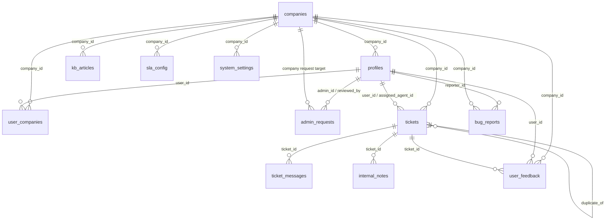

# HelpDesk.AI Database Schema

This document maps the database tables and the main relationships used by HELPDESK.AI.
It is based on the core `schema.sql` file plus the schema-altering migrations under `supabase/migrations/`.

## Core ER Diagram

## Core Tables

### `companies`

| Column | Type | Notes |
| --- | --- | --- |
| `id` | uuid | Primary key, generated with `gen_random_uuid()` |
| `name` | text | Company display name |
| `admin_id` | uuid | Primary admin profile |
| `company_size` | text | Org size metadata |
| `industry` | text | Industry classification |
| `website` | text | Public website |
| `country` | text | Company country |
| `status` | text | Defaults to `active` |
| `created_at` | timestamptz | Creation timestamp |
| `updated_at` | timestamptz | Updated via trigger |

### `profiles`

| Column | Type | Notes |
| --- | --- | --- |
| `id` | uuid | Primary key, references `auth.users(id)` |
| `email` | text | Unique email address |
| `full_name` | text | Display name |
| `role` | text | Defaults to `user` |
| `company` | text | Denormalized company name |
| `company_id` | uuid | FK to `companies.id` |
| `profile_picture` | text | Avatar URL |
| `phone` | text | Contact phone |
| `job_title` | text | Role/title metadata |
| `status` | text | Defaults to `pending_email_verification` |
| `created_at` | timestamptz | Creation timestamp |
| `updated_at` | timestamptz | Updated via trigger |

### `user_companies`

| Column | Type | Notes |
| --- | --- | --- |
| `user_id` | uuid | FK to `profiles.id` |
| `company_id` | uuid | FK to `companies.id` |
| `role` | text | Defaults to `member` |
| `created_at` | timestamptz | Creation timestamp |
| `updated_at` | timestamptz | Updated via trigger |
| Primary key | (`user_id`, `company_id`) | Membership join table |

### `admin_requests`

| Column | Type | Notes |
| --- | --- | --- |
| `id` | uuid | Primary key |
| `admin_id` | uuid | FK to `profiles.id` |
| `company_name` | text | Requested company name |
| `company_size` | text | Requested org size |
| `industry` | text | Requested industry |
| `website` | text | Requested website |
| `country` | text | Requested country |
| `phone` | text | Contact phone |
| `job_title` | text | Requester title |
| `status` | text | Defaults to `pending` |
| `reviewed_by` | uuid | FK to `profiles.id`, nullable |
| `review_notes` | text | Reviewer notes |
| `created_at` | timestamptz | Creation timestamp |
| `updated_at` | timestamptz | Updated via trigger |

### `tickets`

| Column | Type | Notes |
| --- | --- | --- |
| `id` | uuid | Primary key |
| `user_id` | uuid | FK to `profiles.id`, nullable |
| `company_id` | uuid | FK to `companies.id` |
| `assigned_agent_id` | uuid | FK to `profiles.id`, nullable |
| `subject` | text | Ticket subject |
| `summary` | text | Short summary |
| `description` | text | Full description |
| `category` | text | Categorized issue area |
| `priority` | text | Defaults to `medium` |
| `status` | text | Defaults to `open` |
| `metadata` | jsonb | Flexible payload data |
| `ai_confidence` | numeric(5,4) | Confidence score |
| `duplicate_of` | uuid | Self-referential FK to `tickets.id` |
| `resolved_at` | timestamptz | Resolution timestamp |
| `closed_at` | timestamptz | Closure timestamp |
| `auto_closed` | boolean | Defaults to `false` |
| `last_user_viewed_at` | timestamptz | Last view time |
| `created_at` | timestamptz | Creation timestamp |
| `updated_at` | timestamptz | Updated via trigger |

### `ticket_messages`

| Column | Type | Notes |
| --- | --- | --- |
| `id` | uuid | Primary key |
| `ticket_id` | uuid | FK to `tickets.id` |
| `sender_id` | uuid | FK to `profiles.id`, nullable |
| `sender_name` | text | Display sender name |
| `message` | text | Message body |
| `message_type` | text | Defaults to `text` |
| `is_internal` | boolean | Defaults to `false` |
| `created_at` | timestamptz | Creation timestamp |

### `internal_notes`

| Column | Type | Notes |
| --- | --- | --- |
| `id` | uuid | Primary key |
| `ticket_id` | uuid | FK to `tickets.id` |
| `agent_id` | uuid | FK to `profiles.id` |
| `note` | text | Internal note body |
| `created_at` | timestamptz | Creation timestamp |

### `bug_reports`

| Column | Type | Notes |
| --- | --- | --- |
| `id` | uuid | Primary key |
| `reporter_id` | uuid | FK to `profiles.id`, nullable |
| `company_id` | uuid | FK to `companies.id`, nullable |
| `bug_title` | text | Title |
| `description` | text | Details |
| `severity` | text | Defaults to `medium` |
| `status` | text | Defaults to `open` |
| `created_at` | timestamptz | Creation timestamp |
| `updated_at` | timestamptz | Updated via trigger |

### `enterprise_leads`

| Column | Type | Notes |
| --- | --- | --- |
| `id` | uuid | Primary key |
| `company_name` | text | Prospect company name |
| `contact_name` | text | Lead contact |
| `email` | text | Contact email |
| `phone` | text | Optional phone |
| `website` | text | Website |
| `message` | text | Inquiry text |
| `status` | text | Defaults to `new` |
| `created_at` | timestamptz | Creation timestamp |
| `updated_at` | timestamptz | Updated via trigger |

### `kb_articles`

| Column | Type | Notes |
| --- | --- | --- |
| `id` | uuid | Primary key |
| `company_id` | uuid | FK to `companies.id` |
| `title` | text | Knowledge base title |
| `content` | text | Article content |
| `category` | text | Topic grouping |
| `tags` | text[] | Tag array |
| `search_vector` | tsvector | Full-text search index |
| `created_at` | timestamptz | Creation timestamp |
| `updated_at` | timestamptz | Updated via trigger |

### `knowledge_base`

| Column | Type | Notes |
| --- | --- | --- |
| `id` | uuid | Primary key |
| `title` | text | Article title |
| `content` | text | Article content |
| `embedding` | vector(384) | Semantic vector |
| `category` | text | Category label |
| `created_at` | timestamptz | Creation timestamp |

### `sla_config`

| Column | Type | Notes |
| --- | --- | --- |
| `id` | uuid | Primary key |
| `company_id` | uuid | Unique FK to `companies.id` |
| `priority` | text | Priority name |
| `resolution_sla_hours` | integer | SLA target |
| `created_at` | timestamptz | Creation timestamp |
| `updated_at` | timestamptz | Updated via trigger |

### `user_feedback`

| Column | Type | Notes |
| --- | --- | --- |
| `id` | uuid | Primary key |
| `user_id` | uuid | FK to `profiles.id`, nullable |
| `company_id` | uuid | FK to `companies.id`, nullable |
| `ticket_id` | uuid | FK to `tickets.id`, nullable |
| `feedback_type` | text | Feedback type |
| `rating` | integer | Optional rating |
| `comment` | text | Optional comment |
| `created_at` | timestamptz | Creation timestamp |

### `system_settings`

| Column | Type | Notes |
| --- | --- | --- |
| `company_id` | uuid | Unique FK to `companies.id` |
| `ai_confidence_threshold` | float | Defaults to `0.80` |
| `duplicate_sensitivity` | float | Defaults to `0.85` |
| `enable_auto_resolve` | boolean | Defaults to `false` |
| `auto_close_enabled` | boolean | Defaults to `true` |
| `auto_close_days` | integer | Defaults to `7` |
| `email_notifications` | boolean | Defaults to `true` |
| `admin_alerts` | boolean | Defaults to `true` |
| `digest_frequency` | text | Defaults to `daily` |
| `created_at` | timestamptz | Creation timestamp |
| `updated_at` | timestamptz | Updated via trigger |

## Relationships At A Glance

- `companies` is the tenant root table.
- `profiles.company_id` points to `companies.id`.
- `user_companies` is the join table for many-to-many user membership across companies.
- `tickets.company_id` points to `companies.id`.
- `tickets.user_id` and `tickets.assigned_agent_id` both point to `profiles.id`.
- `ticket_messages.ticket_id` and `internal_notes.ticket_id` both point to `tickets.id`.
- `bug_reports.company_id` and `user_feedback.company_id` point to `companies.id`.
- `user_feedback.ticket_id` points to `tickets.id`.
- `system_settings.company_id` and `sla_config.company_id` are one row per company.
- `tickets.duplicate_of` is a self-reference to another ticket row.

## Database Objects Added By Migrations

The schema also grows with migration-owned tables that support security, notifications, and admin workflows:

- `audit_logs`
- `api_tokens`, `api_token_usage`, `api_token_audit`
- `agent_scorecards`
- `consent_log`, `consent_logs`, `privacy_requests`, `privacy_audit_logs`, `user_privacy_preferences`
- `notification_queue`, `notifications`, `email_logs`
- `webhook_settings`
- `sla_policies`, `escalation_logs`, `sla_escalations`
- `sso_providers`, `sso_role_mappings`, `sso_provisioning_settings`, `sso_audit_logs`
- `knowledge_gaps`
- `saved_searches`
- `routing_rules`
- `ticket_ratings`
- `encryption_audit_logs`, `encryption_key_rotation_history`

## Notes

- RLS and tenant checks are enforced through `auth.uid()` / `auth.role()`-based policies in the migrations.
- Core search and ML features rely on `vector`, `pg_net`, and `tsvector` support.
- The schema assumes Supabase-style auth tables under `auth.*`.
