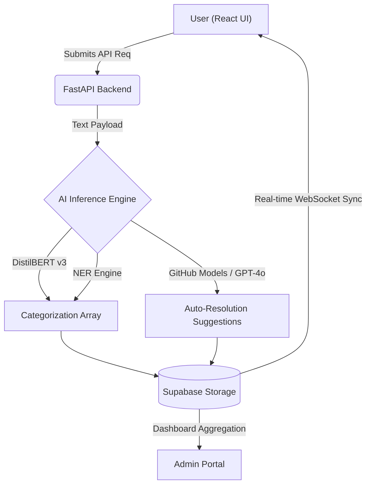

  

> [!NOTE]
> Helpdesk.AI utilizes a clean, decoupled architecture built for production SaaS environments. It is structured into multiple layers to ensure separation of concerns, scalability, and strict security isolation.

 

<table width="100%">
  <tr>
    <td width="35%" valign="top">
      <h2>System Architecture</h2>
      
The system is split horizontally:

      <ul>
        <li><strong>Frontend</strong>: React for user interactions.</li>
        <li><strong>Backend</strong>: High-speed FastAPI routing.</li>
        <li><strong>Database</strong>: Supabase with strictly controlled Row-Level Security (RLS).</li>
        <li><strong>Intelligence</strong>: The custom AI Inference Engine handles <i>Text Processing</i> and <i>Reasoning</i> as side-effects before database commits.</li>
      </ul>
    </td>
    <td width="65%" valign="top">
       

    </td>
  </tr>
</table>

  

> [!IMPORTANT]
> ### The AI Neural Pipeline
> Helpdesk.AI leverages a custom-orchestrated suite of models, natively augmented with GitHub Models integration to separate logic layers.

<table width="100%">
  <tr>
    <td width="33%" valign="top">
      <h4>High-Precision Classification</h4>
      
Driven by <b>DistilBERT v3</b>, our classifier understands deep technical context and user sentiment to assign accurate Priority Impact Scores without hallucinating.

    </td>
    <td width="33%" valign="top">
      <h4>Metadata Harvesting</h4>
      
A custom NER pipeline extracts crucial infrastructure identifiers automatically from plain text (e.g., Hostnames, IP Addresses, Browser types) eliminating manual forms.

    </td>
    <td width="34%" valign="top">
      <h4>GitHub Models Integration</h4>
      
For complex logic like generating resolution steps or summarizing massive email threads, we pivot to <b>GitHub Models via Azure AI</b> (specifically `gpt-4o`) to ensure conversational accuracy.

    </td>
  </tr>
</table>
