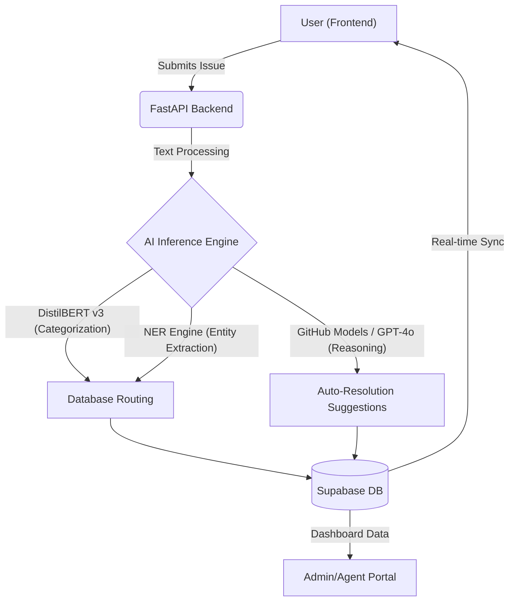

# Architecture

Helpdesk.AI utilizes a clean, decoupled architecture built for production SaaS environments. It is structured into multiple layers to ensure separation of concerns, scalability, and security.

## 1. System Architecture

## 2. The AI Neural Pipeline

Under the hood, Helpdesk.AI leverages a custom-orchestrated suite of models, now augmented with GitHub Models integration.

### High-Precision Classification
Driven by **DistilBERT v3**, our classifier understands technical context and user sentiment to assign accurate Impact Scores (`Low` -> `Critical`).

### NER Metadata Harvesting
Extracts crucial infrastructure identifiers:
- **Assets:** IP Addresses, Hostnames.
- **Environment:** OS, Browser types.

### GitHub Models Integration
For complex reasoning, resolving, and summarization, we integrate directly with **GitHub Models** via Azure AI Inference. This allows us to instantly swap to the best LLMs (like `gpt-4o`) for tasks such as:
- Generating user-friendly resolution steps.
- Summarizing massive email threads into concise ticket descriptions.
- Generating knowledge base articles dynamically.

*See `scripts/github_models_bridge.py` and `.github/workflows/models-evaluation.yml` for implementation details.*
