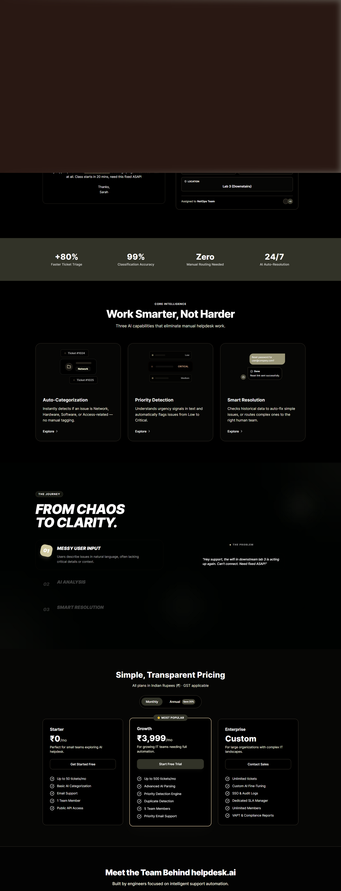

# Welcome to Helpdesk.AI

  

 

## The Intelligent Standard for Enterprise IT

> *Helpdesk.AI doesn't just manage tickets. It transforms chaos into clarity in milliseconds.*

Welcome to the official documentation and internal blog for the **Helpdesk.AI** platform. Here, you'll find everything from architectural deep-dives to guides on how our neural pipeline functions under heavy load.

 

### 🚀 What makes us different?

Normally, enterprise support desks are bogged down by Level 1 manual triage. It takes humans minutes to read, categorize, and route an issue. 

We replaced that bottleneck with a fine-tuned **DistilBERT** Sequence Classifier and **GitHub Models** powered reasoning layer.

1. **<kbd>Categorization</kbd> is Instantaneous**: Wait times drop to `~50ms`.
2. **<kbd>Entity Extraction</kbd> is Automatic**: We pull Hostnames and IP Addresses out of plain text automatically using NER.
3. **<kbd>AI Auto-Resolution</kbd> is Proactive**: The moment a user types their issue, our Gemini-backed inference engine attempts to solve it before it even hits the human queue.

---

### 🎨 Chaos to Clarity UI

  

 

We didn't just build a smart backend; we paired it with a sleek, dark-mode first UI that uses rich emeralds and indigos to ease eye strain for IT professionals staring at logs all day. 

### 🗂️ Explore the Wiki
* **[Platform Architecture](./Architecture)**: See how the 4-layer Python/React stack operates.
* **[Interactive Demo](https://helpdeskaiv1.vercel.app/)**: Try the live simulator.

---

  Built with 💚 and strict precision.

