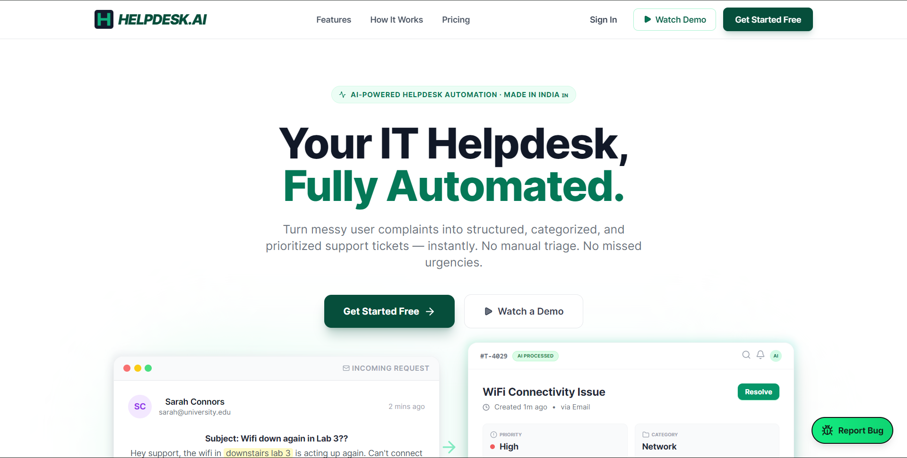
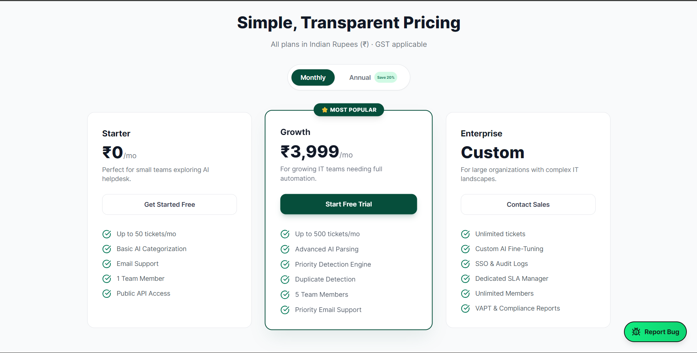

  

 

> [!NOTE]
> **Helpdesk.AI** doesn't just manage tickets. It transforms infrastructure chaos into operational clarity in milliseconds. Welcome to the official documentation hub.

 

<table width="100%">
  <tr>
    <td width="60%" valign="top">
      <h2>The Triaging Bottleneck, Solved.</h2>
      
Normally, enterprise support desks are bogged down by Level 1 manual triage. It takes humans minutes to read, categorize, and route a single issue.

      
We replaced that bottleneck with a fine-tuned <b>DistilBERT</b> Sequence Classifier and an advanced <b>GitHub Models</b> reasoning layer.

      <ul>
        <li><strong>Categorization</strong>: Instantaneous (~50ms)</li>
        <li><strong>Entity Extraction</strong>: Automatic via Custom NER</li>
        <li><strong>AI Resolution</strong>: Proactive GitHub Models inference</li>
      </ul>
    </td>
    <td width="40%" valign="top">
        
      
        
      
    </td>
  </tr>
</table>

  

> [!IMPORTANT]
> ### Transparent Scalability
> We didn't just build a smart backend; we paired it with a sleek UI that uses rich emeralds and deep indigos to ease eye strain. Designed for enterprise orchestration.

  

 

  

